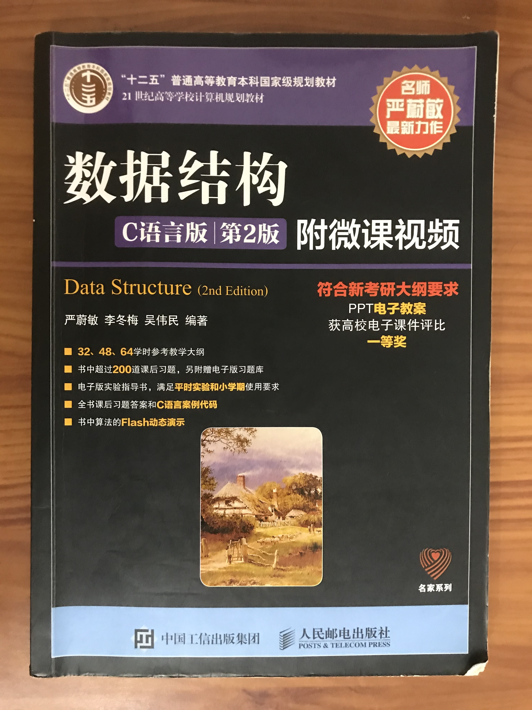

# 数据结构

## 介绍
本项目是在学习《数据结构：C语言版》时，自己对书中相关数据结构和算法的具体实现。由于在写代码的过程中发现 Dev C++ 写项目不太方便，于是在中途中改用 Xcode 实现项目，所以目前存在前面为 Dev C++ 项目，后面为 Xcode 项目的现象。打算以后继续完善本仓库，让本项目在 Mac 平台和 Win 平台都能运行。

## 所用软件
* Dev C++
* Xcode

## 参考资料
[[1] 严蔚敏.数据结构：C语言版（第2版）[M].北京：人民邮电出版社，2015.](https://item.jd.com/12320030.html) 
[[2] 王卓.数据结构与算法基础.](https://www.bilibili.com/read/cv3285768)
